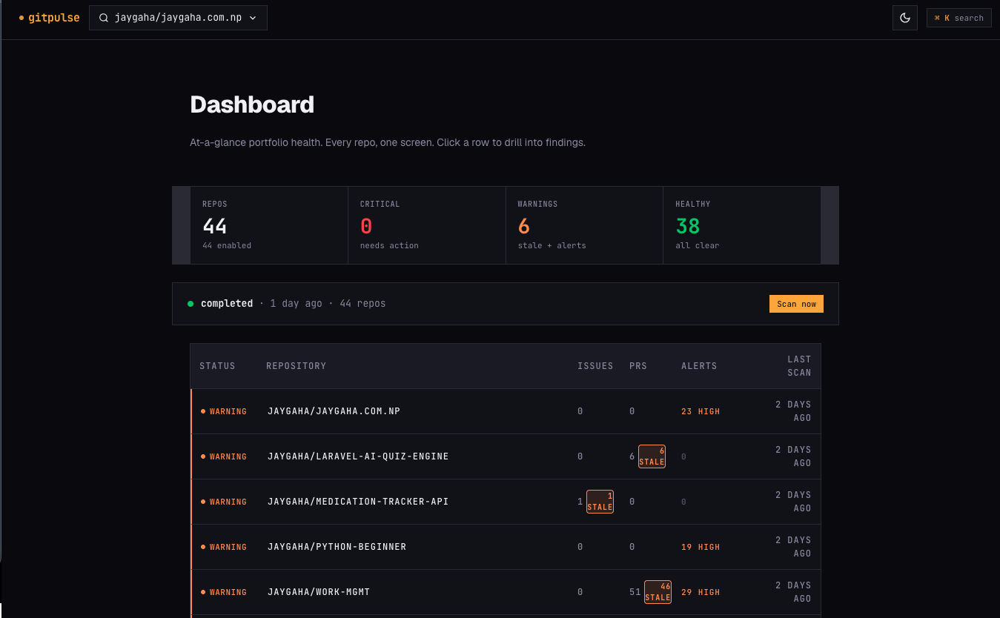
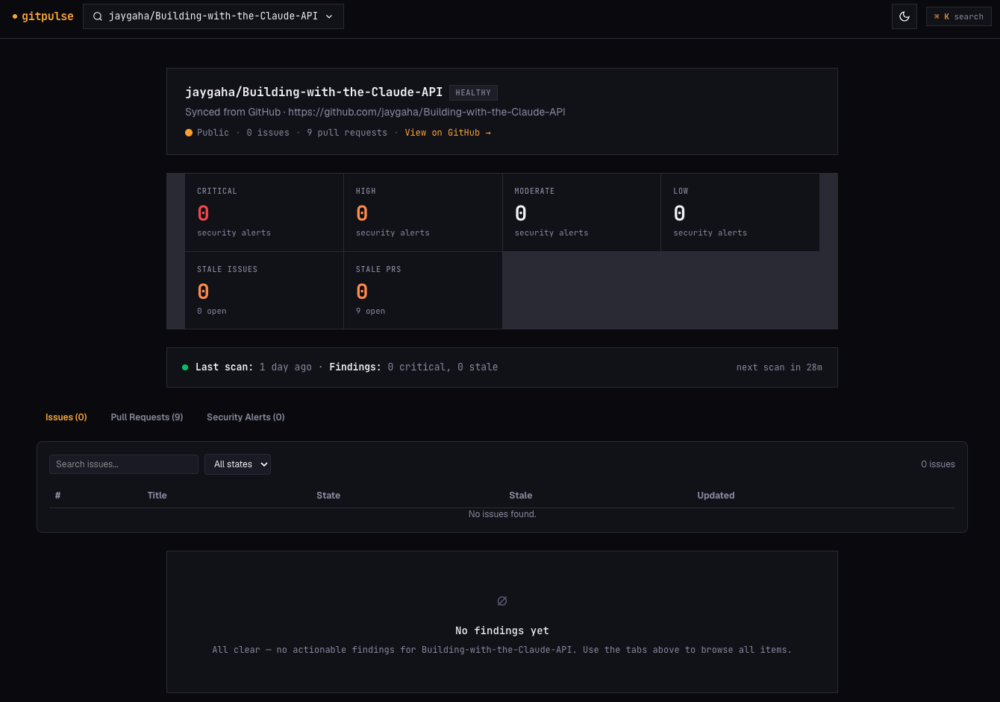

# GitPulse

<p align="center">
<a href="https://github.com/laravel/framework/actions"></a>
<a href="https://packagist.org/packages/laravel/framework"></a>
<a href="https://packagist.org/packages/pestphp/pest"></a>
<a href="https://packagist.org/packages/livewire/livewire"></a>
<a href="https://opensource.org/licenses/MIT"></a>
</p>

Personal GitHub observability dashboard: stale issues, stale pull requests, and security alerts (Dependabot + Code Scanning) across all your GitHub repositories — public and private.

Built with **Laravel 13**, **Livewire 3**, **Tailwind CSS 4**, **Pest**. DDD-style layering (`Domain` → `Application` → `Infrastructure` → `Livewire`).

## Screenshots




## Features (MVP)

- Repo discovery from your GitHub account (public + private), archived-repo tracking
- Issues & PR sync with configurable staleness thresholds (global default + per-repo override)
- Security alerts: Dependabot (REST) + Code Scanning (GraphQL), with GitHub-backed dismiss
- Hourly scheduled scan + manual "Scan now" button, database queue, atomic progress tracking
- Rate-limit-aware API clients; no test ever touches the network

## Requirements

- PHP 8.4 (Herd recommended)
- Composer
- Node.js ≥ 22 (only for building frontend assets)

## Setup

```bash
composer install
cp .env.example .env          # then set GITHUB_TOKEN (repo + security_events scopes)
php artisan key:generate
touch database/database.sqlite
php artisan migrate
npm install && npm run build  # needs Node.js on PATH
```

## Running

```bash
php artisan serve                 # dashboard at http://127.0.0.1:8000
php artisan queue:work            # process scan jobs
php artisan schedule:work         # hourly scans (or system cron)
php artisan scan:dispatch --sync  # manual full scan (sync)
```

First scan: run `php artisan scan:dispatch --sync` once so repositories are discovered before the UI has anything to show.

### Configuration (.env)

| Key | Purpose |
|-----|---------|
| `GITHUB_TOKEN` | Personal access token (needs `repo` + `security_events`) |
| `GITHUB_PER_PAGE` | API page size (default 100 internally) |
| `GITHUB_RATE_LIMIT_PAUSE` | Seconds to sleep when rate limit runs low |

Global staleness default lives in the `settings` table (`stale_threshold_days`, seeded to 30). Per-repo overrides via `repositories.stale_threshold_days`.

## Testing

```bash
php artisan test
```

126 tests across Domain units, Application handlers/queries, Infrastructure persistence + fixture-replayed GitHub clients, and Livewire feature tests. No network access in tests.
